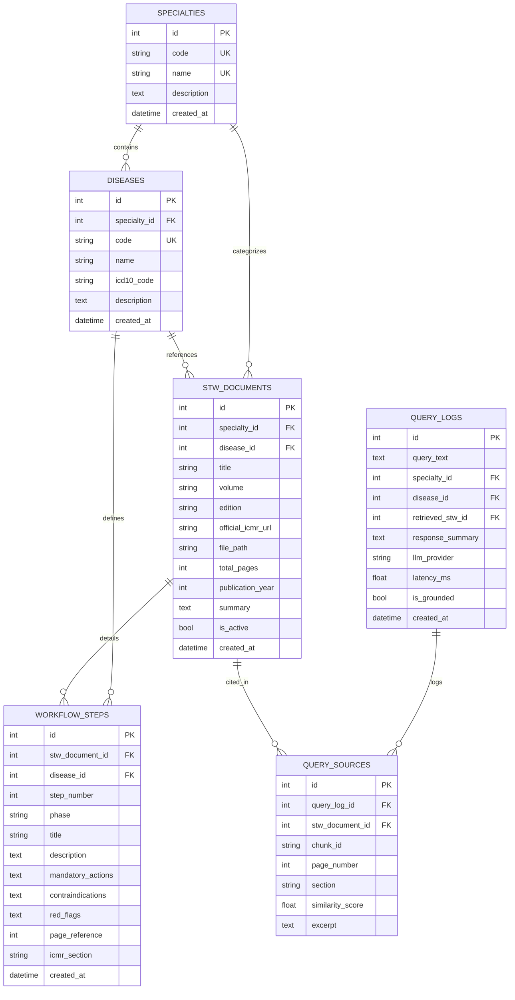

# ICMR-STW AI: Database Architecture & Schema Design

## 1. Dual-Store Philosophy

To ensure fast query latency, strict relational integrity, and deep semantic retrieval, ICMR-STW AI employs a **Dual-Store Strategy**:
1. **Relational Database (PostgreSQL / SQLite)**: Stores structured clinical metadata, disease taxonomies, discrete workflow steps, and audit logs.
2. **Vector Database (ChromaDB)**: Stores high-dimensional dense embeddings of text chunks with metadata filters for fast semantic search.

---

## 2. Relational Schema (SQLAlchemy ORM)

---

## 3. Vector Database Collection (ChromaDB)

- **Collection Name**: `icmr_stw_chunks`
- **Embedding Space**: 384 dimensions (`all-MiniLM-L6-v2`) or 768 dimensions (`bge-base-en-v1.5`)
- **Metadata Fields Attached to Every Vector**:
  - `document_id`: Integer foreign key matching `stw_documents.id`
  - `specialty_code`: String code (e.g., `NEPHRO`)
  - `disease_code`: String code (e.g., `CKD`)
  - `disease_name`: String name (e.g., `Chronic Kidney Disease`)
  - `volume`: String volume label (e.g., `Volume 1`)
  - `page_number`: Integer source PDF page
  - `section`: Identified clinical section (e.g., `Initial Assessment`)
  - `chunk_index`: Sequence offset within the document
  - `chunk_id`: Unique identifier string (e.g., `ICMR-CKD-P04-C02`)
